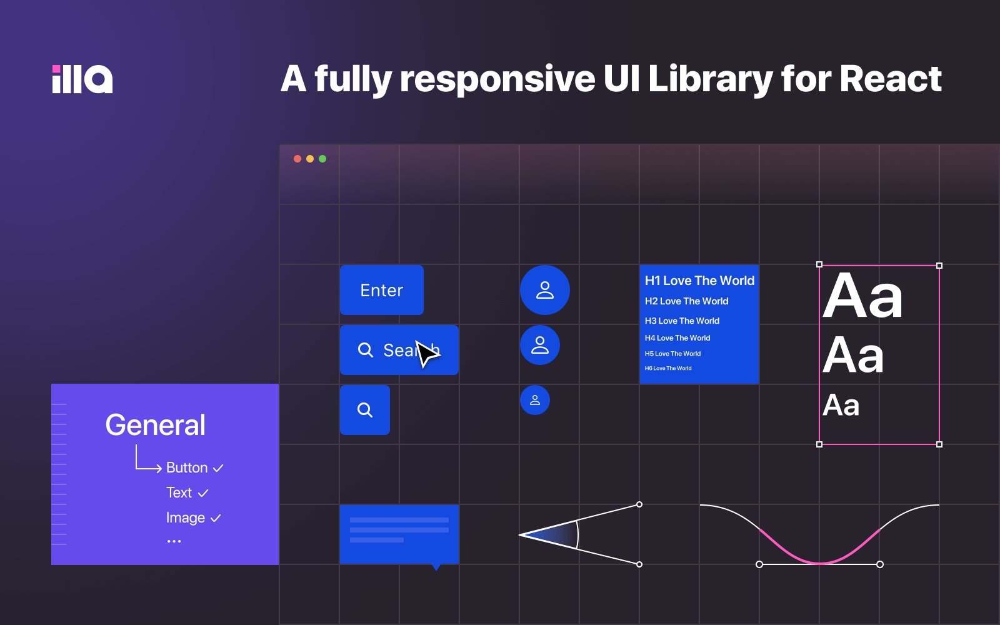

<div align="center">
    
</div>

<h1 align="center">IFLOWAGENT Design</h1>

<p align="center">Accelerate your internal tools development.</p>

<div align="center">
  <p>Create with ❤︎ by <a href="https://github.com/khulnasoft-lab/flowagent-design/graphs/contributors">contributors</a></p>
</div>



[](https://discord.gg/khulnasoft-lab)
[](https://twitter.com/khulnasoft-labHQ)
[](https://design.flowagentfamily.com)
[](https://codecov.io/gh/khulnasoft-lab/flowagent-design)
[](./LICENSE)
[](./CONTRIBUTING.md)

## ✨ Features

1. 🛠 **Made for React:** Ready-to-use component library for React.
2. 📝 **TypeScript Friendly:** Come with TypeScript typings out of the box and support with predictable static typings.
3. 📦 **High Productivity:** Easy and fast, import in 5 seconds.
4. 🎨 **Vibrant Design:** Beautifully designed components and powerful theming system supports custom themes to match
   your brand, including light and dark mode.
5. 🌍 **Internationalization:** Each component was designed with i18n in mind and multiple languages are supported.
6. 📱 **Fully Responsive:** Perfectly adaptable with all the devices, desktops to mobiles.

## 💡 Components

You can review all components in Storybook.

[](https://design.flowagentfamily.com)

## 🖥 Fast Try

You can quickly use IFLOWAGENT Design on codesandbox.

[](https://codesandbox.io/s/flowagent-design-demo-r1qyy2?fontsize=14&hidenavigation=1&theme=dark)

## 🚀 Get Started

Step 1: Install

```bash
$ pnpm add @flowagent-design/react @emotion/react framer-motion

# or

$ npm i @flowagent-design/react @emotion/react framer-motion
```

Step 2: Use

```tsx
import { Tag } from '@flowagent-design/react';

const App = () => (
  <div>
    <Tag>Hello IFLOWAGENT</Tag>
  </div>
);
```

## ⌨️ Development

Step 1: Clone locally.

```bash
$ git clone https://github.com/khulnasoft-lab/flowagent-design.git
$ cd flowagent-design
$ pnpm install
```

Step 2: Run.

```bash
$ pnpm storybook
```

Then your can open storybook in your browser.

## 💬 Community

Join IFLOWAGENT Community to share your ideas, suggestions or questions and connect with other users and contributors.

<b>Discussion</b>

[](https://github.com/orgs/khulnasoft-lab/discussions)

<b>Hangout together!</b>

[](https://discord.gg/khulnasoft-lab)

## 🌱 Contributing

Thinking about contributing? All kinds of contributions to IFLOWAGENT are greatly appreciated and welcomed! Check
out [Contributing Guide](./CONTRIBUTING.md) for details about how you can get involved.

## 🔥 We're Hiring

Looking for a passionate and creative team? We are actively hiring engineers for the following positions:

- Frontend Engineer
- Golang Engineer

Contact Us: hr@flowagentsoft.com

## License

This project is [Apache License 2.0](./LICENSE).
